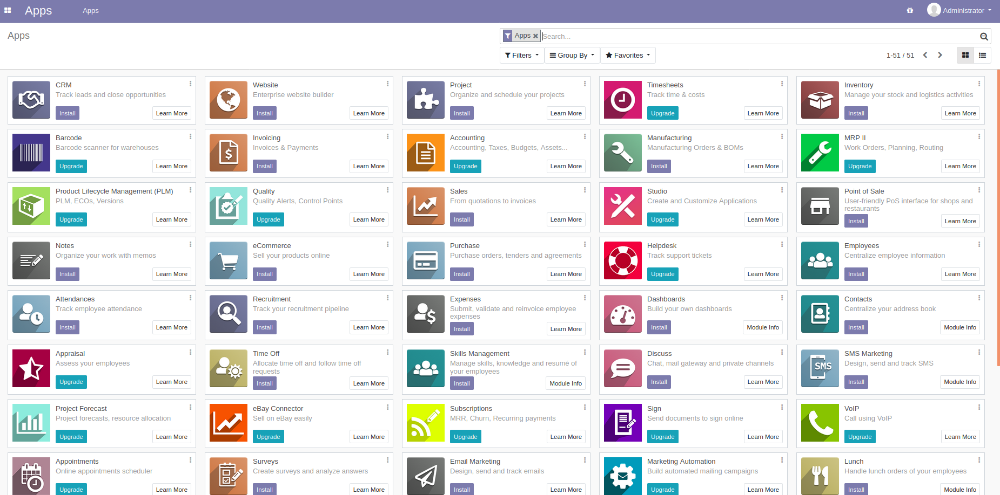

# Deploiement de Odoo avec minikube

## Description
Ce code source est effectué au sein de RIF pour faire le déploiement de Odoo avec minikube.
This is our architecture to build:

## Présentation Odoo
Odoo est un logiciel qui est utilisé par plus de quatre millions d’utilisateurs pour gérer leurs entreprises à travers le monde3. Odoo est le système ERP open-source le plus populaire. Tu peux consulter cette page pour plus de details ***https://www.odoo.com/****
  

## Etapes

### Etape1: Installer minikube

> minikube start 

### Etape2: cloner le code source

Cloner le code source dans un répertoire sur votre PC puis:
> kubectl apply -f odoo_with_minikube/odoo.yaml

Pour voir vos pods et vos services crée: 

> kubectl get pods -n odoo
>kubectl get services -n odoo
>kubectl get ingress -n odoo

### Etape3: Ouvrir l'application dans le navigateur

Tout d'abord, lancer cette commande pour voir l'adresse de minikube 

> curl rif.info/

Ouvrez le lien dans votre navigateur pout créer votre premiere base de données. Après avoir crée votre base de donnée, vous pouvez acceder et télécharger vos plugin selon votre besoin:

  
